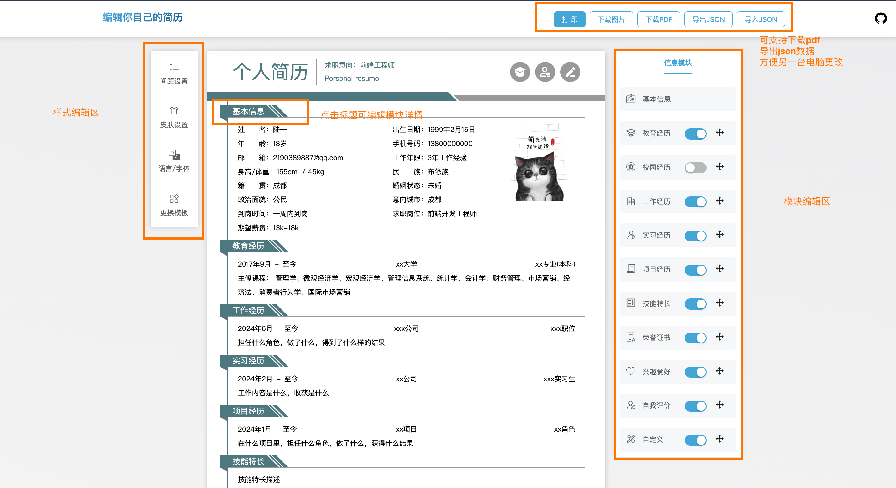

# simpleCV

## 网页简介

静态网站体验：[simpleCV](https://coder66y.github.io/simpleCV)

### 支持如下功能
#### 样式编辑区
1. 更改简历颜色
2. 设置简历字体，边距，大小
3. 中英文切换
#### 模块编辑区
1. 增加修改模块
2. 删除模块
3. 自定义模块
#### 头部操作区
4. 导出为图片
5. 打印
6. 导出为pdf，可直接使用pdf
7. 导出|导入json,方便另一台电脑修改简历

### 优点
1. 简单易用
2. 让用户只关注简历内容书写，不用关注简历样式
3. 即时导出，获取产物
4. 可更换不同模块

### todo
1. 增加后台服务

## 开发者手册
[coder66y](https://github.com/coder66y)
运行：`npm run dev`
构建：`npm run build`
gitPages部署 `npm run deploy`
